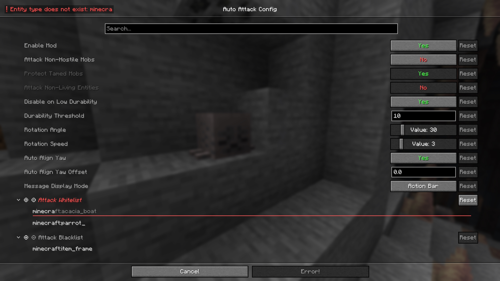

# Auto Attack V3

Minecraft mod that automates attacking entities in front of the player based on configurable rules.

## Features
- Hits mobs that are within reach and at the crosshair
- Highly customizable config accessable with [Cloth Config API](https://modrinth.com/mod/cloth-config) (+ [Mod Menu](https://modrinth.com/mod/modmenu) on Fabric)
- Rotation mode to cover a larger hit area.
- Item breaking prevention
- Customizable entity whitelist and blacklist

## Supported Platforms
Auto Attack V3 is currently available for Fabric or Neoforge on Minecraft: Java Edition 1.21.7 or newer.
